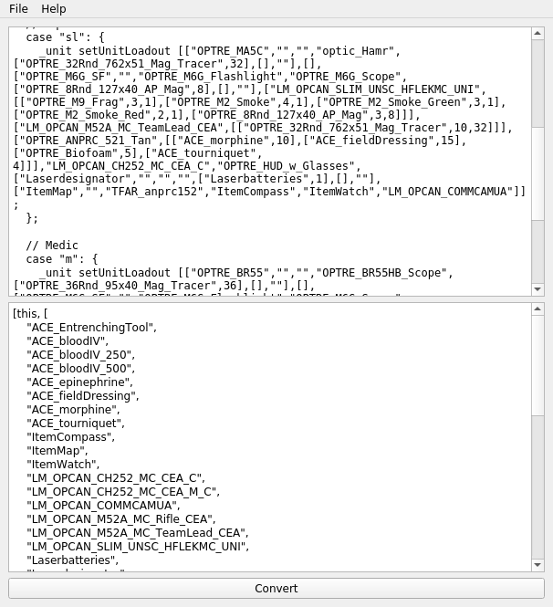

# QtLola

This tool converts MC framework simple assignGear files to code to make the
same items appear in an ACE Limited Arsenal.

The EXE file is standalone (run from desktop or wherever) and allows you to
paste the file contents, and then produces the SQF for a limited arsenal. Paste
that code into the `init` of a box in-game and you're done.

License: Apache License v2
